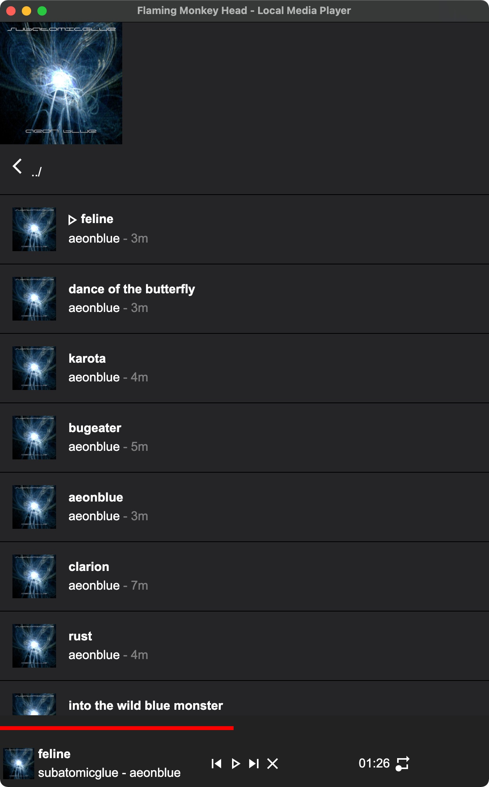

# Flaming Monkey Head - Local & DLNA/uPNP Music Player

A music player to play media files from the local filesystem + USB drives, uPNP/DLNA media servers on the local network...


Running as:
 - dedicated hardware (raspberry pi based)
 - desktop app  (MacOS, Win, Linux)

Status:
 - Alpha (Experimental... in development, things will be broken)




## Tech
Standalone app written in React (18) and NodeJS (14), packaged into an Electron (20) application.   We use Typescript and React function components.

## Features
  - General:
    - **Formats Supported:**  mp3, m4a, aac, wav
    - **Locations Supported:**  Local Filesystem; uPNP/DLNA
    - **GUI:**  HTML Responsive Layout
  - Browser:
    - **Root Directories Feature:**  configure top-level roots such as USB drive, local filesystem directories, etc..   app starts in the roots view, and when user navigates up the hierarchy, eventually will get back to these roots
    - **Folder Icons show album art:** derived from Folder.jpg|png|gif, first jpg|png|gif found
    - **Music File Icons show album art:** derived from Folder.jpg|png|gif, /musicfilename/.jpg|png|gif. or track's cover-art tag
    - Music File title|album|duration derived from tag info, or filename
    - Play indicator on the track, when playing
  - Player:
    - **Current Track display:** Art, Title, Album, Artist
    - **Transport Controls:**  PrevTrack, NextTrack, Pause/Play, Stop
    - **Repeat Modes**, when track is finished playing:  "Play All", "Repeat All", "Play 1", "Repeat 1"
    - Interactive Timeline Progress Meter:  scrub through the playing track
    - **Auto Click Removal:** Fade to Silence 0.1s from end of track to avoid pop.

## Future Work:
  - IMMEDIATE TODO:
    - bigger play controls for large fingers :)
    - filter out any . files from the file listing
    - config file for the ROOTs (what you see when you navigate all the way .. up
    - remove titlebar and menu
    - power button in upper right to exit
    - store settings so they're persistant... (e.g. repeat mode)
      - location configurable (if using RO filesystem, can use USB stick instead)
    - tapping the playing title resets back to that folder...
  - Better hero image / banner w/title+description at top.
  - Folder Icons derived from embedded tagged art when no images in folder
  - build for the raspberry pi, convert / clean out the old scripts from the project I copied this from...
  - make a release in github (upload app bundles)
  - think about DLNA / uPnP browsing


# Development (Troubleshooting Notes)

- Add a package for renderer only, and nodejs complains:
```
> cross-env NODE_ENV=development TS_NODE_TRANSPILE_ONLY=true webpack --config ./.erb/configs/webpack.config.renderer.dev.dll.ts
ERROR in dll renderer renderer[10]
Module not found: Error: Can't resolve 'xhrjs' in '~/src/electron-react-boilerplate'

webpack compiled with 1 error
```

edit `./.erb/configs/webpack.config.renderer.dev.dll.ts`, and add your package to
```
externals: ['fsevents', 'crypto-browserify', 'xhrjs'],
```
...edit like so ^^^, to exclude (I dont understand this, but it works, YMMV.)


<br>

<p>
  Electron React Boilerplate uses <a href="https://electron.atom.io/">Electron</a>, <a href="https://facebook.github.io/react/">React</a>, <a href="https://github.com/reactjs/react-router">React Router</a>, <a href="https://webpack.js.org/">Webpack</a> and <a href="https://www.npmjs.com/package/react-refresh">React Fast Refresh</a>.
</p>

<br>

<div align="center">

[![Build Status][github-actions-status]][github-actions-url]
[![Github Tag][github-tag-image]][github-tag-url]
[](https://discord.gg/Fjy3vfgy5q)

[](#backers)
[](#sponsors)
[![StackOverflow][stackoverflow-img]][stackoverflow-url]

</div>

## Install

Clone the repo and install dependencies:

```bash
git clone --depth 1 --branch main https://github.com/electron-react-boilerplate/electron-react-boilerplate.git your-project-name
cd your-project-name
npm install
```

**Having issues installing? See our [debugging guide](https://github.com/electron-react-boilerplate/electron-react-boilerplate/issues/400)**

## Starting Development

Start the app in the `dev` environment:

```bash
npm start
```

## Packaging for Production

To package apps for the local platform:

```bash
npm run package
```

## Docs

See our [docs and guides here](https://electron-react-boilerplate.js.org/docs/installation)

## Community

Join our Discord: https://discord.gg/Fjy3vfgy5q

## Donations

**Donations will ensure the following:**

- 🔨 Long term maintenance of the project
- 🛣 Progress on the [roadmap](https://electron-react-boilerplate.js.org/docs/roadmap)
- 🐛 Quick responses to bug reports and help requests

## Backers

Support us with a monthly donation and help us continue our activities. [[Become a backer](https://opencollective.com/electron-react-boilerplate-594#backer)]

<a href="https://opencollective.com/electron-react-boilerplate-594/backer/0/website" target="_blank"></a>
<a href="https://opencollective.com/electron-react-boilerplate-594/backer/1/website" target="_blank"></a>
<a href="https://opencollective.com/electron-react-boilerplate-594/backer/2/website" target="_blank"></a>
<a href="https://opencollective.com/electron-react-boilerplate-594/backer/3/website" target="_blank"></a>
<a href="https://opencollective.com/electron-react-boilerplate-594/backer/4/website" target="_blank"></a>
<a href="https://opencollective.com/electron-react-boilerplate-594/backer/5/website" target="_blank"></a>
<a href="https://opencollective.com/electron-react-boilerplate-594/backer/6/website" target="_blank"></a>
<a href="https://opencollective.com/electron-react-boilerplate-594/backer/7/website" target="_blank"></a>
<a href="https://opencollective.com/electron-react-boilerplate-594/backer/8/website" target="_blank"></a>
<a href="https://opencollective.com/electron-react-boilerplate-594/backer/9/website" target="_blank"></a>
<a href="https://opencollective.com/electron-react-boilerplate-594/backer/10/website" target="_blank"></a>
<a href="https://opencollective.com/electron-react-boilerplate-594/backer/11/website" target="_blank"></a>
<a href="https://opencollective.com/electron-react-boilerplate-594/backer/12/website" target="_blank"></a>
<a href="https://opencollective.com/electron-react-boilerplate-594/backer/13/website" target="_blank"></a>
<a href="https://opencollective.com/electron-react-boilerplate-594/backer/14/website" target="_blank"></a>
<a href="https://opencollective.com/electron-react-boilerplate-594/backer/15/website" target="_blank"></a>
<a href="https://opencollective.com/electron-react-boilerplate-594/backer/16/website" target="_blank"></a>
<a href="https://opencollective.com/electron-react-boilerplate-594/backer/17/website" target="_blank"></a>
<a href="https://opencollective.com/electron-react-boilerplate-594/backer/18/website" target="_blank"></a>
<a href="https://opencollective.com/electron-react-boilerplate-594/backer/19/website" target="_blank"></a>
<a href="https://opencollective.com/electron-react-boilerplate-594/backer/20/website" target="_blank"></a>
<a href="https://opencollective.com/electron-react-boilerplate-594/backer/21/website" target="_blank"></a>
<a href="https://opencollective.com/electron-react-boilerplate-594/backer/22/website" target="_blank"></a>
<a href="https://opencollective.com/electron-react-boilerplate-594/backer/23/website" target="_blank"></a>
<a href="https://opencollective.com/electron-react-boilerplate-594/backer/24/website" target="_blank"></a>
<a href="https://opencollective.com/electron-react-boilerplate-594/backer/25/website" target="_blank"></a>
<a href="https://opencollective.com/electron-react-boilerplate-594/backer/26/website" target="_blank"></a>
<a href="https://opencollective.com/electron-react-boilerplate-594/backer/27/website" target="_blank"></a>
<a href="https://opencollective.com/electron-react-boilerplate-594/backer/28/website" target="_blank"></a>
<a href="https://opencollective.com/electron-react-boilerplate-594/backer/29/website" target="_blank"></a>

## Sponsors

Become a sponsor and get your logo on our README on Github with a link to your site. [[Become a sponsor](https://opencollective.com/electron-react-boilerplate-594-594#sponsor)]

<a href="https://opencollective.com/electron-react-boilerplate-594/sponsor/0/website" target="_blank"></a>
<a href="https://opencollective.com/electron-react-boilerplate-594/sponsor/1/website" target="_blank"></a>
<a href="https://opencollective.com/electron-react-boilerplate-594/sponsor/2/website" target="_blank"></a>
<a href="https://opencollective.com/electron-react-boilerplate-594/sponsor/3/website" target="_blank"></a>
<a href="https://opencollective.com/electron-react-boilerplate-594/sponsor/4/website" target="_blank"></a>
<a href="https://opencollective.com/electron-react-boilerplate-594/sponsor/5/website" target="_blank"></a>
<a href="https://opencollective.com/electron-react-boilerplate-594/sponsor/6/website" target="_blank"></a>
<a href="https://opencollective.com/electron-react-boilerplate-594/sponsor/7/website" target="_blank"></a>
<a href="https://opencollective.com/electron-react-boilerplate-594/sponsor/8/website" target="_blank"></a>
<a href="https://opencollective.com/electron-react-boilerplate-594/sponsor/9/website" target="_blank"></a>
<a href="https://opencollective.com/electron-react-boilerplate-594/sponsor/10/website" target="_blank"></a>
<a href="https://opencollective.com/electron-react-boilerplate-594/sponsor/11/website" target="_blank"></a>
<a href="https://opencollective.com/electron-react-boilerplate-594/sponsor/12/website" target="_blank"></a>
<a href="https://opencollective.com/electron-react-boilerplate-594/sponsor/13/website" target="_blank"></a>
<a href="https://opencollective.com/electron-react-boilerplate-594/sponsor/14/website" target="_blank"></a>
<a href="https://opencollective.com/electron-react-boilerplate-594/sponsor/15/website" target="_blank"></a>
<a href="https://opencollective.com/electron-react-boilerplate-594/sponsor/16/website" target="_blank"></a>
<a href="https://opencollective.com/electron-react-boilerplate-594/sponsor/17/website" target="_blank"></a>
<a href="https://opencollective.com/electron-react-boilerplate-594/sponsor/18/website" target="_blank"></a>
<a href="https://opencollective.com/electron-react-boilerplate-594/sponsor/19/website" target="_blank"></a>
<a href="https://opencollective.com/electron-react-boilerplate-594/sponsor/20/website" target="_blank"></a>
<a href="https://opencollective.com/electron-react-boilerplate-594/sponsor/21/website" target="_blank"></a>
<a href="https://opencollective.com/electron-react-boilerplate-594/sponsor/22/website" target="_blank"></a>
<a href="https://opencollective.com/electron-react-boilerplate-594/sponsor/23/website" target="_blank"></a>
<a href="https://opencollective.com/electron-react-boilerplate-594/sponsor/24/website" target="_blank"></a>
<a href="https://opencollective.com/electron-react-boilerplate-594/sponsor/25/website" target="_blank"></a>
<a href="https://opencollective.com/electron-react-boilerplate-594/sponsor/26/website" target="_blank"></a>
<a href="https://opencollective.com/electron-react-boilerplate-594/sponsor/27/website" target="_blank"></a>
<a href="https://opencollective.com/electron-react-boilerplate-594/sponsor/28/website" target="_blank"></a>
<a href="https://opencollective.com/electron-react-boilerplate-594/sponsor/29/website" target="_blank"></a>

## Maintainers

- [Amila Welihinda](https://github.com/amilajack)
- [John Tran](https://github.com/jooohhn)
- [C. T. Lin](https://github.com/chentsulin)
- [Jhen-Jie Hong](https://github.com/jhen0409)

## License

MIT © [Electron React Boilerplate](https://github.com/electron-react-boilerplate)

[github-actions-status]: https://github.com/electron-react-boilerplate/electron-react-boilerplate/workflows/Test/badge.svg
[github-actions-url]: https://github.com/electron-react-boilerplate/electron-react-boilerplate/actions
[github-tag-image]: https://img.shields.io/github/tag/electron-react-boilerplate/electron-react-boilerplate.svg?label=version
[github-tag-url]: https://github.com/electron-react-boilerplate/electron-react-boilerplate/releases/latest
[stackoverflow-img]: https://img.shields.io/badge/stackoverflow-electron_react_boilerplate-blue.svg
[stackoverflow-url]: https://stackoverflow.com/questions/tagged/electron-react-boilerplate
